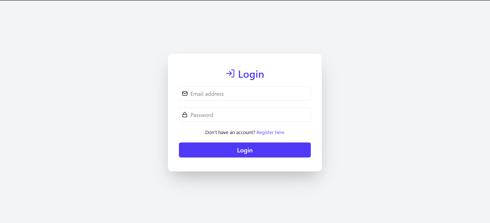
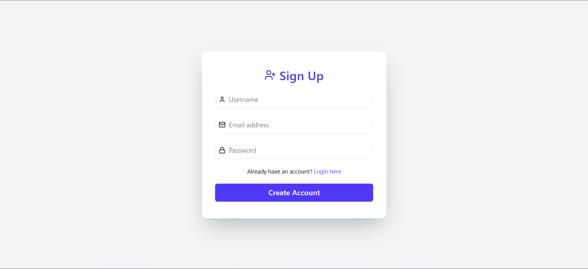

# 🔐 React Login & Signup Form

A simple and responsive authentication form built with **React**, styled using **Tailwind CSS**, and enhanced with **Lucide icons**. This project allows users to register and log in, with data securely stored using `localStorage`.

## ✨ Features

- 🔁 Toggle between Login and Sign Up mode
- ✅ Form validation with required fields
- 💾 Save and retrieve user data from `localStorage`
- 📣 Feedback messages for success or error
- 🎨 Clean and modern UI with Lucide icons
- 📱 Responsive design (mobile-friendly)

## 📷 Demo Preview

**Login Form**


**Sign Up Form**


## 🛠️ Tech Stack

- [React](https://reactjs.org/)
- [Tailwind CSS](https://tailwindcss.com/)
- [Lucide React](https://lucide.dev/)

## 📦 Installation

1. **Clone the repository**

```bash
git clone https://github.com/yourusername/react-login-form.git
cd react-login-form
```

2. Install Dependencies
```bash
npm install
```

3. Run the Projects
```bash
npm run dev
```

## 🔐 How It Works
- On Sign Up, the app checks if the email already exists.
- If not, it stores the new user (name, email, password) into localStorage.
- On Login, the app validates the email and password against stored users.
- Displays success or error messages based on the result.
